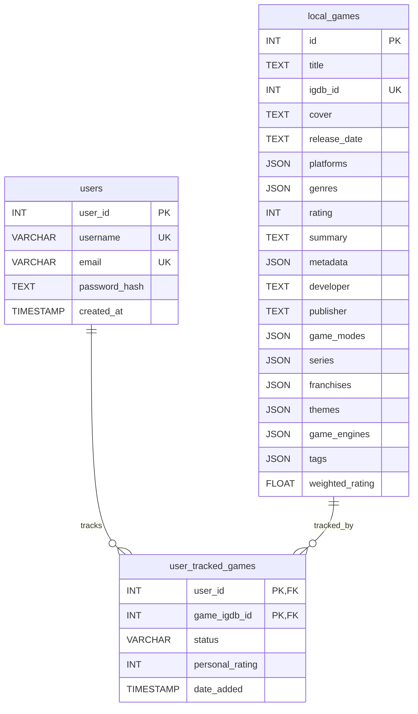

# Plan: Implementing Multi-User Support and Advanced DBMS Features

## Goal

Enhance the Video Game Tracker application by adding support for multiple users, allowing each user to maintain their own tracked game library with status and ratings. Incorporate and demonstrate key DBMS concepts including Normalization, Indexing, Views, and Transactions.

## Phase 1: Database Schema Modifications

Define the necessary tables and relationships to support multiple users and their tracked games.

**1. `users` Table:** Stores user credentials and basic information.

```sql
CREATE TABLE IF NOT EXISTS users (
    user_id INT AUTO_INCREMENT PRIMARY KEY,
    username VARCHAR(50) UNIQUE NOT NULL,
    email VARCHAR(100) UNIQUE NOT NULL,
    password_hash TEXT NOT NULL, -- Store hashed passwords, never plain text
    created_at TIMESTAMP DEFAULT CURRENT_TIMESTAMP
);
```

**2. `user_tracked_games` Table:** Links users to games they track, storing user-specific details.

```sql
CREATE TABLE IF NOT EXISTS user_tracked_games (
    user_id INT NOT NULL,
    game_igdb_id INT NOT NULL,
    status VARCHAR(20) DEFAULT 'Planning', -- e.g., 'Playing', 'Completed', 'Planning', 'Dropped'
    personal_rating INT, -- User's personal rating (e.g., 1-10), nullable
    date_added TIMESTAMP DEFAULT CURRENT_TIMESTAMP,
    
    PRIMARY KEY (user_id, game_igdb_id), -- Composite primary key
    FOREIGN KEY (user_id) REFERENCES users(user_id) ON DELETE CASCADE, -- If user is deleted, their tracking info is removed
    FOREIGN KEY (game_igdb_id) REFERENCES local_games(igdb_id) ON DELETE CASCADE -- If game is removed from local_games, tracking info is removed
);
```
*Note: Assumes `local_games` is the definitive source table for games.*

**3. Schema Diagram (Mermaid):**



**4. Implementation:** Update `db_setup.py` to include functions that execute these `CREATE TABLE` statements, including the Foreign Key constraints.

## Phase 2: Backend Implementation (Flask)

Implement the server-side logic for user authentication and managing tracked games.

1.  **Authentication:**
    *   Implement `/register` route (POST): Hash password using `werkzeug.security.generate_password_hash`, store user in `users` table.
    *   Implement `/login` route (POST): Fetch user by username, verify password using `werkzeug.security.check_password_hash`, store `user_id` in `flask.session`.
    *   Implement `/logout` route: Clear user info from `flask.session`.
    *   Create a `@login_required` decorator to protect routes.
2.  **Game Tracking:**
    *   Modify `/add_game/<igdb_id>`:
        *   Apply `@login_required`.
        *   Ensure game exists in `local_games` (fetch/add if needed).
        *   `INSERT INTO user_tracked_games (user_id, game_igdb_id) VALUES (?, ?)` using `session['user_id']` and `igdb_id`. Handle potential errors (e.g., game already tracked by user).
    *   Create `/my_library` route (GET):
        *   Apply `@login_required`.
        *   `SELECT lg.*, utg.status, utg.personal_rating FROM user_tracked_games utg JOIN local_games lg ON utg.game_igdb_id = lg.igdb_id WHERE utg.user_id = ?` using `session['user_id']`.
        *   Pass results to `my_library.html` template.
    *   Create `/update_game_status/<igdb_id>` route (POST):
        *   Apply `@login_required`.
        *   `UPDATE user_tracked_games SET status = ?, personal_rating = ? WHERE user_id = ? AND game_igdb_id = ?` using form data, `session['user_id']`, and `igdb_id`.

## Phase 3: Frontend Implementation (HTML Templates)

Create and modify HTML templates for user interaction.

1.  **New Templates:** `register.html`, `login.html`, `my_library.html`.
2.  **Forms:** Add forms for registration, login, and updating game status/rating in the library.
3.  **Navigation/Layout:** Add Login/Register/Logout links. Display logged-in user status.
4.  **Conditional Display:** Only show "Add to Library" buttons/links if the user is logged in.
5.  **Library Display:** Show tracked games with their details, status, and rating on `my_library.html`.

## Phase 4: Incorporating Advanced DBMS Concepts

Integrate and document the use of specific DBMS features.

1.  **Normalization:**
    *   **Explanation:** Document how creating `users` and `user_tracked_games` separates user data, game data, and the many-to-many relationship, reducing redundancy and improving integrity (achieving at least 3NF for this part). Contrast this with potentially storing tracked status directly in a hypothetical single `games` table if only one user was supported.
    *   **(Optional Deeper Dive):** Normalize a JSON field (e.g., `platforms`).
        *   Create `platforms` (`platform_id PK`, `name UNIQUE`).
        *   Create `game_platforms` (`game_igdb_id FK`, `platform_id FK`, `PRIMARY KEY(game_igdb_id, platform_id)`).
        *   Modify `top_games_loader.py` to populate these instead of the JSON column.
        *   Modify relevant `SELECT` queries (e.g., for game details) to use `JOIN`s: `... JOIN game_platforms gp ON lg.igdb_id = gp.game_igdb_id JOIN platforms p ON gp.platform_id = p.platform_id ...`.
        *   Document this process and the trade-offs (reduced redundancy vs. query complexity).
2.  **Indexing:**
    *   **Identify Columns:** `users.username`, `users.email` (for login/uniqueness checks), `user_tracked_games.user_id` (for loading library), `local_games.title` (if adding text search).
    *   **Implementation:** Add `CREATE INDEX` statements (e.g., `CREATE INDEX idx_users_username ON users(username);`, `CREATE INDEX idx_user_tracked_games_user ON user_tracked_games(user_id);`).
    *   **Explanation:** Document the indexes created and explain how they speed up specific queries (e.g., finding a user during login, fetching all games for a user).
3.  **Views:**
    *   **Implementation:** Define a view to simplify library fetching:
      ```sql
      CREATE VIEW user_library_details AS 
      SELECT 
          u.user_id, u.username, 
          utg.status, utg.personal_rating, utg.date_added,
          lg.* -- Select all columns from local_games
      FROM users u 
      JOIN user_tracked_games utg ON u.user_id = utg.user_id 
      JOIN local_games lg ON utg.game_igdb_id = lg.igdb_id;
      ```
    *   **Usage:** Modify `/my_library` backend logic to `SELECT * FROM user_library_details WHERE user_id = ?`.
    *   **Explanation:** Document the view definition and explain how it encapsulates the join logic, making the application code cleaner.
4.  **Transactions:**
    *   **Scenario:** Consider an operation like "Register User and Add First Game". This requires inserting into `users` and then `user_tracked_games`.
    *   **Implementation:** Wrap the sequence of database operations in the relevant Flask route within an explicit transaction:
      ```python
      try:
          connection.start_transaction()
          # cursor.execute(INSERT into users...)
          # user_id = cursor.lastrowid 
          # cursor.execute(INSERT into user_tracked_games...)
          connection.commit()
      except Error as e:
          connection.rollback()
          # Handle error
      ```
    *   **Explanation:** Document the scenario and explain how the transaction ensures atomicity – either both inserts succeed, or neither does, preventing inconsistent states.
